# Логический порядок

1. FROM
2. ON
3. JOIN
4. WHERE
5. GROUP BY
6. WITH CUBE или WITH ROLLUP
7. HAVING
8. SELECT
9. OVER
10. DISTINCT
11. ORDER BY
12. В начало

## Простые запросы. SELECT и FROM

- Нужно вывести всех пользователей из таблицы customer

```sql
SELECT * FROM customer;
```

- вывести определенные столбцы, то их нужно перечислить

```sql
SELECT customer_id, last_name, first_name FROM customer;
```

## Простые запросы. ALIAS

Алиасы (псевдонимы) нужны для того, чтобы задавать временные названия для столбцов и таблиц. Алиасы для столбцов позволяют дать понятные названия для вычисляемых значений, а краткие алиасы для таблиц позволяют упростить написание запросов. Для задания алиасов используется оператор AS, но его можно опускать. Чтобы не писать полные названия таблиц, зададим в запросе на следующем слайде краткие алиасы и для вычисляемого столбца также зададим временное имя с обозначением результата.

```sql
SELECT f.title, c.name, f.rental_rate/f.rental_duration AS cost_per_day
FROM film f
JOIN film_category fc ON fc.film_id = f.film_id
JOIN category c ON c.category_id = fc. category_id;
```

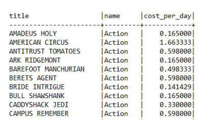

## Простые запросы. ORDER BY

В независимости от того, в каком порядке данные хранятся в базе данных, SQL возвращает результат в непредсказуемом порядке. Чтобы явно задать порядок сортировки, используется оператор ORDER BY. Для того чтобы задать направление сортировки, нужно указывать `ASC` – от меньшего к большему (по умолчанию) или `DESC` – от большего к меньшему. Давайте возьмем запрос с получением стоимости аренды фильма за день и отсортируем по стоимости аренды за день от большего к меньшему, а потом по названию фильма.

```sql
SELECT title, rental_rate/rental_duration AS cost_per_day
FROM film
ORDER BY cost_per_day DESC, title;
```

## Простые запросы. LIMIT и OFFSET

Если нужно получить первые N записей из результата, используется оператор `LIMIT`. Если нужно исключить из результата первые N записей, используется оператор `OFFSET`. Возьмем предыдущий запрос и получим первые 10 записей начиная с 58.

```sql
SELECT title, rental_rate/rental_duration AS cost_per_day
FROM film
ORDER BY cost_per_day DESC, title
LIMIT 10
OFFSET 57;
```

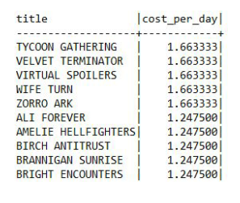

### Простые запросы. DISTINCT

Для получения уникальных значений в результате, используется оператор `DISTINCT`.

- К примеру, нужно получить уникальный список имен пользователей:

```sql
SELECT DISTINCT first_name
FROM customer;
```

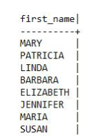

- Если нужно получить уникальные значения по нескольким столбцам, то данные столбцы перечисляются после оператора `DISTINCT`:

```sql
SELECT DISTINCT last_name, first_name
FROM customer;
```

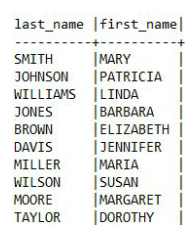

## Простые запросы. WHERE

Как правило, при получении данных нужно указать условия, по которым нужно их отфильтровать, для этого используется оператор `WHERE`. Если условий нужно использовать несколько, то используются логические операторы `AND` и `OR`. Для отрицания в условии используется оператор `NOT`.

Выведем в результат платежи:

- более 7 у.е. и которые совершил сотрудник с идентификатором равным 2,
- менее 5 у.е. и которые совершил сотрудник с идентификатором равным 1.

Обратите внимание, что оператор `AND` имеет приоритет перед `OR`

```sql
SELECT *
FROM payment
WHERE amount > 7 AND staff_id = 2 OR amount < 5 AND staff_id = 1;
```

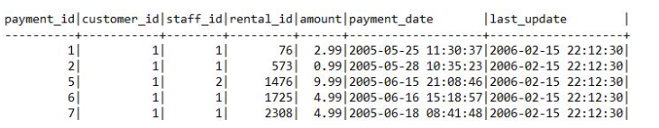

## Простые запросы. CAST

При работе с разными типами данных часто нужно преобразовывать один тип данных к другому, для этого используется оператор CAST со следующим синтаксисом:

```sql
CAST(value AS type)
```


В таблице payment столбец payment_date имеет тип данных datetime, то есть дата и время, а нужно работать только с датой, для этого преобразуем datetime к date:

```sql
SELECT payment_id, CAST(payment_date AS DATE)
FROM payment;
```

Таблица приведения типов, на примере MSSQL

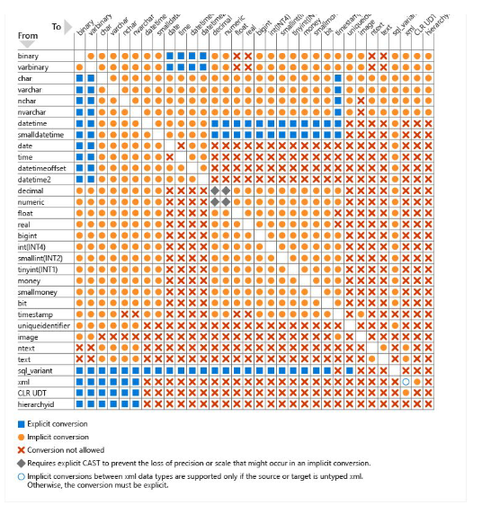

## Округление

Для округления в MySQL используются следующие функции:

- ROUND – округляет число до заданного числа десятичных знаков,
- TRUNCATE – усекает число до указанного числа десятичных знаков,
- FLOOR – возвращает наибольшее целочисленное значение, которое меньше или равно числу,
- CEIL – возвращает наименьшее целочисленное значение, которое больше или равно числу,
- ABS – возвращает абсолютное (положительное) значение числа.

Округлим значения используя разные функции:

```sql
SELECT ROUND(100.576); -- 101
SELECT ROUND(100.576, 2); -- 100.58
SELECT TRUNCATE(100.576, 2); -- 100.57
SELECT FLOOR(100.576); -- 100
SELECT CEIL(100.576); -- 101
SELECT ABS(-100.576); -- 100.576
```

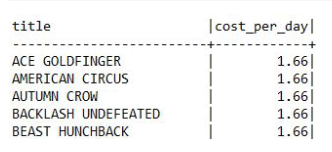

Получим «красивый» результат стоимости аренды за день:

```sql
SELECT title, ROUND(rental_rate/rental_duration, 2) AS cost_per_day
FROM film
ORDER BY cost_per_day DESC, title
```

## Арифметические операторы

SQL поддерживает все основные арифметические операторы:

- - – * / – стандартные операторы,
- POWER – возведение в степень,
- SQRT – возвращает квадратный корень числа,
- COS, SIN, TAN, COT, etc – геометрические операторы,
- DIV – целочисленное деление,
- % – остаток от деления,
- GREATEST/LEAST – возвращает наибольшее/наименьшее значение из списка,
- RAND – возвращает случайное число в диапазоне от 0 (включительно) до 1 (исключительно).

Посмотрим на работу некоторых функций:

```sql
SELECT POWER(2, 3); -- 8
SELECT SQRT(64); -- 8
SELECT 64 DIV 6; -- 10
SELECT 64%6; -- 4
SELECT GREATEST(17, 5, 18, 21, 16); -- 21
SELECT LEAST(17, 5, 18, 21, 16); -- 5
SELECT RAND(); -- 0.005757967015502944
```

Посмотрим на работу некоторых функций на данных:

```sql
SELECT  rental_rate, rental_duration,
        rental_rate + rental_duration a,
        rental_rate – rental_duration b,
        rental_rate * rental_duration c,
        rental_rate / rental_duration d,
        rental_rate % rental_duration e,
        rental_rate DIV rental_duration f,
        POWER(rental_rate, rental_duration) g,
        COS(rental_rate) h, SIN(rental_duration) j
FROM film;
```

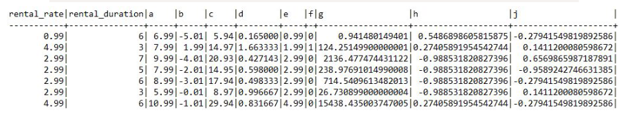

## Работа со строками

Разберем основные функции для работы с подстроками и строками:

- CONCAT, CONCAT_WS – соединяет строки в одну,_WS – по сепаратору,
- LENGTH – возвращает длину строки в байтах,
- CHAR_LENGTH – возвращает длину строки в символах,
- POSITION – возвращает позицию первого вхождения подстроки в строку,
- SUBSTR – извлекает подстроку из строки.
- LEFT / RIGHT – извлекает ряд символов из строки начиная слева / справа,
- LOWER / UPPER – преобразует строку в нижний / верхний регистр,
- INSERT – вставляет подстроку в строку в указанной позиции и для определенного количества символов,
- TRIM – удаляет начальные и конечные пробелы из строки,
- REPLACE – заменяет все вхождения подстроки в строке на новую подстроку,
- SUBSTRING_INDEX – возвращает подстроку строки до того, как появится указанное число разделителей.

Давайте разберем, как эти функции работают на практике:

```sql
SELECT CONCAT(last_name, ' ', first_name, ' ', email) FROM customer;
SELECT CONCAT_WS(' ', last_name, first_name, email) FROM customer;
```

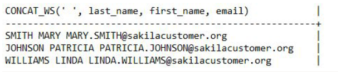

```sql
SELECT  LENGTH(last_name), CHAR_LENGTH(last_name),
        LENGTH('Привет'), CHAR_LENGTH('Привет')
FROM customer;
```

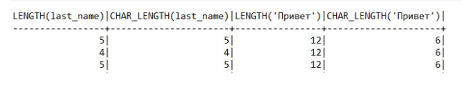

```sql
SELECT  POSITION('D' IN last_name), SUBSTR(last_name, 2, 3),
        LEFT(last_name, 3), RIGHT(last_name, 3)
FROM customer;
```

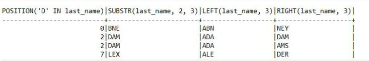

```sql
SELECT LOWER(last_name), INSERT(last_name, 'MAX', 1, 5),
REPLACE(last_name, 'A', 'X')
FROM customer;
```

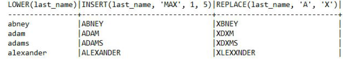

Выражение `LIKE` возвращает true, если строка соответствует заданному шаблону. Выражение `NOT LIKE` возвращает `false`, когда`LIKE` возвращает true и наоборот. Если шаблон не содержит знаков процента и подчеркиваний, тогда шаблон представляет в точности строку и `LIKE` работает как оператор сравнения. Подчеркивание (_) в шаблоне подменяет (вместо него подходит) любой символ. Знак процента (%) подменяет любую (в том числе и пустую) последовательность символов.

```sql
SELECT CONCAT(last_name, ' ', first_name)
FROM customer
WHERE first_name LIKE '%jam%';
```

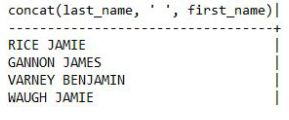

## Работа с датами и временем

Разберем основные функции для работы с датами и временем:

- NOW / CURDATE – возвращает текущие дату и время / дату,
- DATE_ADD – добавляет интервал времени/даты к дате, а затем возвращает дату, работает как с датой, так и со временем,
- DATE_SUB – вычитает интервал времени/даты из даты, а затем возвращает дату, работает как с датой, так и со временем,
- YEAR / MONTH / DAY — возвращает год / месяц / день месяца для заданной даты,
- EXTRACT – извлекает часть из заданной даты,
- DATEDIFF – возвращает количество дней между двумя значениями даты,
- QUARTER – возвращает квартал года для заданного значения даты,
- DATE_FORMAT – форматирует указанную дату,
- TIME_FORMAT – форматирует время по заданному формату,
- DATE – извлекает дату из выражения datetime.

```sql
SELECT DATE_ADD(NOW(), INTERVAL 3 DAY);
```

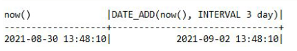

```sql
SELECT DATE_SUB(CURDATE(), INTERVAL 3 DAY);
```

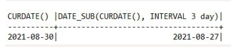

```sql
SELECT YEAR(NOW()), MONTH(NOW()), WEEK(NOW()), DAY(NOW());
```

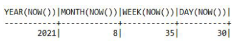

```sql
SELECT EXTRACT(HOUR FROM NOW()), EXTRACT(DAY_MINUTE FROM NOW()),
EXTRACT(DAY FROM NOW());
```

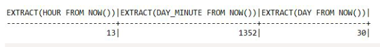

```sql
SELECT DATEDIFF(return_date, rental_date), QUARTER(return_date) FROM rental;
```

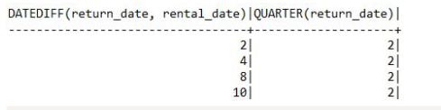

```sql
SELECT DATE_FORMAT(payment_date, '%D – %A – %Y'),
TIME_FORMAT(TIME(payment_date), '%R') FROM payment;
```

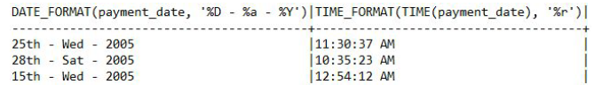

При работе с датой и временем нужно помнить: если из `DATE` сделать `DATETIME`, то это будет дата с нулевым временем. К примеру, есть дата ‘2020-01-01’, если с ней работать, как с
`DATETIME`, то SQL будет эту дату воспринимать, как ‘2020-01-01 00:00:00’. Соответственно, если значения в БД хранятся в DATETIME, но в запросе нужно работать именно с датами, то нужно явно приводить значения к нужному типу данных. Причем это касается не только дат, но и остальных типов данных.

## BETWEEN

Для того чтобы найти значения в заданном диапазоне, используется оператор BETWEEN. Данный оператор можно использовать с числами, строками и датами. Крайние значения включаются в результат. К примеру, нужно найти все платежи, стоимость которых между 5 и 7 включительно:

```sql
SELECT * FROM payment WHERE amount BETWEEN 5 AND 7;
```

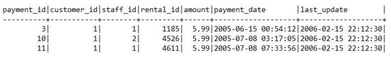

