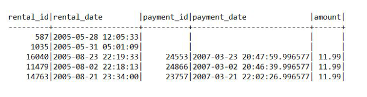
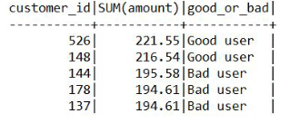

# Логический порядок

1. FROM
2. ON
3. JOIN
4. WHERE
5. GROUP BY
6. WITH CUBE или WITH ROLLUP
7. HAVING
8. SELECT
9. OVER
10. DISTINCT
11. ORDER BY
12. В начало

## Простые запросы. SELECT и FROM

- Нужно вывести всех пользователей из таблицы customer

```sql
SELECT * FROM customer;
```

- вывести определенные столбцы, то их нужно перечислить

```sql
SELECT customer_id, last_name, first_name FROM customer;
```

## Простые запросы. ALIAS

Алиасы (псевдонимы) нужны для того, чтобы задавать временные названия для столбцов и таблиц. Алиасы для столбцов позволяют дать понятные названия для вычисляемых значений, а краткие алиасы для таблиц позволяют упростить написание запросов. Для задания алиасов используется оператор AS, но его можно опускать. Чтобы не писать полные названия таблиц, зададим в запросе на следующем слайде краткие алиасы и для вычисляемого столбца также зададим временное имя с обозначением результата.

```sql
SELECT f.title, c.name, f.rental_rate/f.rental_duration AS cost_per_day
FROM film f
JOIN film_category fc ON fc.film_id = f.film_id
JOIN category c ON c.category_id = fc. category_id;
```


## Простые запросы. ORDER BY

В независимости от того, в каком порядке данные хранятся в базе данных, SQL возвращает результат в непредсказуемом порядке. Чтобы явно задать порядок сортировки, используется оператор ORDER BY. Для того чтобы задать направление сортировки, нужно указывать `ASC` – от меньшего к большему (по умолчанию) или `DESC` – от большего к меньшему. Давайте возьмем запрос с получением стоимости аренды фильма за день и отсортируем по стоимости аренды за день от большего к меньшему, а потом по названию фильма.

```sql
SELECT title, rental_rate/rental_duration AS cost_per_day
FROM film
ORDER BY cost_per_day DESC, title;
```

## Простые запросы. LIMIT и OFFSET

Если нужно получить первые N записей из результата, используется оператор `LIMIT`. Если нужно исключить из результата первые N записей, используется оператор `OFFSET`. Возьмем предыдущий запрос и получим первые 10 записей начиная с 58.

```sql
SELECT title, rental_rate/rental_duration AS cost_per_day
FROM film
ORDER BY cost_per_day DESC, title
LIMIT 10
OFFSET 57;
```


### Простые запросы. DISTINCT

Для получения уникальных значений в результате, используется оператор `DISTINCT`.

- К примеру, нужно получить уникальный список имен пользователей:

```sql
SELECT DISTINCT first_name
FROM customer;
```


- Если нужно получить уникальные значения по нескольким столбцам, то данные столбцы перечисляются после оператора `DISTINCT`:

```sql
SELECT DISTINCT last_name, first_name
FROM customer;
```


## Простые запросы. WHERE

Как правило, при получении данных нужно указать условия, по которым нужно их отфильтровать, для этого используется оператор `WHERE`. Если условий нужно использовать несколько, то используются логические операторы `AND` и `OR`. Для отрицания в условии используется оператор `NOT`.

Выведем в результат платежи:

- более 7 у.е. и которые совершил сотрудник с идентификатором равным 2,
- менее 5 у.е. и которые совершил сотрудник с идентификатором равным 1.

Обратите внимание, что оператор `AND` имеет приоритет перед `OR`

```sql
SELECT *
FROM payment
WHERE amount > 7 AND staff_id = 2 OR amount < 5 AND staff_id = 1;
```


## Простые запросы. CAST

При работе с разными типами данных часто нужно преобразовывать один тип данных к другому, для этого используется оператор CAST со следующим синтаксисом:

```sql
CAST(value AS type)
```


В таблице payment столбец payment_date имеет тип данных datetime, то есть дата и время, а нужно работать только с датой, для этого преобразуем datetime к date:

```sql
SELECT payment_id, CAST(payment_date AS DATE)
FROM payment;
```

Таблица приведения типов, на примере MSSQL


## Округление

Для округления в MySQL используются следующие функции:

- ROUND – округляет число до заданного числа десятичных знаков,
- TRUNCATE – усекает число до указанного числа десятичных знаков,
- FLOOR – возвращает наибольшее целочисленное значение, которое меньше или равно числу,
- CEIL – возвращает наименьшее целочисленное значение, которое больше или равно числу,
- ABS – возвращает абсолютное (положительное) значение числа.

Округлим значения используя разные функции:

```sql
SELECT ROUND(100.576); -- 101
SELECT ROUND(100.576, 2); -- 100.58
SELECT TRUNCATE(100.576, 2); -- 100.57
SELECT FLOOR(100.576); -- 100
SELECT CEIL(100.576); -- 101
SELECT ABS(-100.576); -- 100.576
```


Получим «красивый» результат стоимости аренды за день:

```sql
SELECT title, ROUND(rental_rate/rental_duration, 2) AS cost_per_day
FROM film
ORDER BY cost_per_day DESC, title
```

## Арифметические операторы

SQL поддерживает все основные арифметические операторы:

- `+ – * /` – стандартные операторы,
- POWER – возведение в степень,
- SQRT – возвращает квадратный корень числа,
- COS, SIN, TAN, COT, etc – геометрические операторы,
- DIV – целочисленное деление,
- % – остаток от деления,
- GREATEST/LEAST – возвращает наибольшее/наименьшее значение из списка,
- RAND – возвращает случайное число в диапазоне от 0 (включительно) до 1 (исключительно).

Посмотрим на работу некоторых функций:

```sql
SELECT POWER(2, 3); -- 8
SELECT SQRT(64); -- 8
SELECT 64 DIV 6; -- 10
SELECT 64%6; -- 4
SELECT GREATEST(17, 5, 18, 21, 16); -- 21
SELECT LEAST(17, 5, 18, 21, 16); -- 5
SELECT RAND(); -- 0.005757967015502944
```

Посмотрим на работу некоторых функций на данных:

```sql
SELECT  rental_rate, rental_duration,
        rental_rate + rental_duration a,
        rental_rate – rental_duration b,
        rental_rate * rental_duration c,
        rental_rate / rental_duration d,
        rental_rate % rental_duration e,
        rental_rate DIV rental_duration f,
        POWER(rental_rate, rental_duration) g,
        COS(rental_rate) h, SIN(rental_duration) j
FROM film;
```


## Работа со строками

Разберем основные функции для работы с подстроками и строками:

- CONCAT, CONCAT_WS – соединяет строки в одну,_WS – по сепаратору,
- LENGTH – возвращает длину строки в байтах,
- CHAR_LENGTH – возвращает длину строки в символах,
- POSITION – возвращает позицию первого вхождения подстроки в строку,
- SUBSTR – извлекает подстроку из строки.
- LEFT / RIGHT – извлекает ряд символов из строки начиная слева / справа,
- LOWER / UPPER – преобразует строку в нижний / верхний регистр,
- INSERT – вставляет подстроку в строку в указанной позиции и для определенного количества символов,
- TRIM – удаляет начальные и конечные пробелы из строки,
- REPLACE – заменяет все вхождения подстроки в строке на новую подстроку,
- SUBSTRING_INDEX – возвращает подстроку строки до того, как появится указанное число разделителей.

Давайте разберем, как эти функции работают на практике:

```sql
SELECT CONCAT(last_name, ' ', first_name, ' ', email) FROM customer;
SELECT CONCAT_WS(' ', last_name, first_name, email) FROM customer;
```


```sql
SELECT  LENGTH(last_name), CHAR_LENGTH(last_name),
        LENGTH('Привет'), CHAR_LENGTH('Привет')
FROM customer;
```


```sql
SELECT  POSITION('D' IN last_name), SUBSTR(last_name, 2, 3),
        LEFT(last_name, 3), RIGHT(last_name, 3)
FROM customer;
```


```sql
SELECT LOWER(last_name), INSERT(last_name, 'MAX', 1, 5),
REPLACE(last_name, 'A', 'X')
FROM customer;
```


Выражение `LIKE` возвращает true, если строка соответствует заданному шаблону. Выражение `NOT LIKE` возвращает `false`, когда`LIKE` возвращает true и наоборот. Если шаблон не содержит знаков процента и подчеркиваний, тогда шаблон представляет в точности строку и `LIKE` работает как оператор сравнения. Подчеркивание (_) в шаблоне подменяет (вместо него подходит) любой символ. Знак процента (%) подменяет любую (в том числе и пустую) последовательность символов.

```sql
SELECT CONCAT(last_name, ' ', first_name)
FROM customer
WHERE first_name LIKE '%jam%';
```


## Работа с датами и временем

Разберем основные функции для работы с датами и временем:

- NOW / CURDATE – возвращает текущие дату и время / дату,
- DATE_ADD – добавляет интервал времени/даты к дате, а затем возвращает дату, работает как с датой, так и со временем,
- DATE_SUB – вычитает интервал времени/даты из даты, а затем возвращает дату, работает как с датой, так и со временем,
- YEAR / MONTH / DAY — возвращает год / месяц / день месяца для заданной даты,
- EXTRACT – извлекает часть из заданной даты,
- DATEDIFF – возвращает количество дней между двумя значениями даты,
- QUARTER – возвращает квартал года для заданного значения даты,
- DATE_FORMAT – форматирует указанную дату,
- TIME_FORMAT – форматирует время по заданному формату,
- DATE – извлекает дату из выражения datetime.

```sql
SELECT DATE_ADD(NOW(), INTERVAL 3 DAY);
```


```sql
SELECT DATE_SUB(CURDATE(), INTERVAL 3 DAY);
```


```sql
SELECT YEAR(NOW()), MONTH(NOW()), WEEK(NOW()), DAY(NOW());
```


```sql
SELECT EXTRACT(HOUR FROM NOW()), EXTRACT(DAY_MINUTE FROM NOW()),
EXTRACT(DAY FROM NOW());
```


```sql
SELECT DATEDIFF(return_date, rental_date), QUARTER(return_date) FROM rental;
```


```sql
SELECT DATE_FORMAT(payment_date, '%D – %A – %Y'),
TIME_FORMAT(TIME(payment_date), '%R') FROM payment;
```


При работе с датой и временем нужно помнить: если из `DATE` сделать `DATETIME`, то это будет дата с нулевым временем. К примеру, есть дата ‘2020-01-01’, если с ней работать, как с
`DATETIME`, то SQL будет эту дату воспринимать, как ‘2020-01-01 00:00:00’. Соответственно, если значения в БД хранятся в DATETIME, но в запросе нужно работать именно с датами, то нужно явно приводить значения к нужному типу данных. Причем это касается не только дат, но и остальных типов данных.

## BETWEEN

Для того чтобы найти значения в заданном диапазоне, используется оператор BETWEEN. Данный оператор можно использовать с числами, строками и датами. Крайние значения включаются в результат. К примеру, нужно найти все платежи, стоимость которых между 5 и 7 включительно:

```sql
SELECT * FROM payment WHERE amount BETWEEN 5 AND 7;
```


## JOIN

В SQL JOIN используются для соединения нескольких таблиц и получения из них данных. Существуют следующие типы JOIN:

- INNER JOIN
- LEFT JOIN
- RIGHT JOIN
- FULL JOIN
- CROSS JOIN

В **LEFT OUTER JOIN**, **RIGHT OUTER JOIN** и **FULL OUTER JOIN** ключевое слово **OUTER** можно опустить, оно не обязательно для использования.
Также при использовании **INNER JOIN** можно опустить ключевое слово **INNER** При работе с **JOIN** желательно использовать алиасы, для удобства чтения или написания запросов и указания,из каких таблиц какие столбцы нужно получать.

### INNER JOIN

**INNER JOIN** возвращает данные по строкам, содержащимодинаковые значения. Если смотреть на таблицы как на множества строк, то результат их выполнения можно представить на следующей диаграмме Венна:

Нужно вывести названия фильмов и имена актеров, которые снимались в этих фильмах.

```sql
SELECT f.title, CONCAT(a.last_name, ' ', a.first_name) AS actor_name
FROM film f
INNER JOIN film_actor fa ON fa.film_id = f.film_id
INNER JOIN actor a ON a.actor_id = fa.actor_id;
```


В этом случае можно использовать **INNER JOIN** без потери данных, так как в таблицах есть необходимые ограничения

### LEFT JOIN

**LEFT JOIN** возвращает все данные из левой таблицы. Если по ним есть совпадения в правой, они обогащаются соответствующими данными, иначе туда записывается специальное значение **NULL**

Нужно получить данные по всем пользователям и добавить информацию по городам, в которых они живут

```sql
SELECT CONCAT(c.last_name, ' ', c.first_name), c2.city
FROM customer c
LEFT JOIN address a ON a.address_id = c.address_id
LEFT JOIN city c2 ON c2.city_id = a.city_id;
```


Чтобы получить только те строки, которые не содержат данных в правой таблице, можно использовать оператор **WHERE**

Нужно получить все фильмы, которые не брали в аренду.

```sql
SELECT f.title
FROM film f
LEFT JOIN inventory i ON i.film_id = f.film_id
LEFT JOIN rental r ON r.inventory_id = i.inventory_id
WHERE r.rental_id IS NULL;
```

Здесь получаем 100% данных по всем фильмам, обогащаем через LEFT JOIN данными по аренде. Фильмы, которые не брали в аренду дополняются значениями NULL, по которым и фильтруем в конце запроса


### RIGHT JOIN

**RIGHT JOIN** — это обратная версия **LEFT JOIN**. Возвращает все данные из правой таблицы.Если по ним есть совпадения в левой, они обогащаются соответствующими данными, иначе туда записывается специальное значение **NULL**

Нужно получить список всех городов и добавить информацию по пользователям, которые живут в этих городах

```sql
SELECT CONCAT(c.last_name, ' ', c.first_name), c2.city
FROM customer c
RIGHT JOIN address a ON a.address_id = c.address_id
RIGHT JOIN city c2 ON c2.city_id = a.city_id;
```


### FULL JOIN

**FULL JOIN** не поддерживается MySQL. Рассмотрим его синтаксис в других СУБД и как реализовать в MySQL.
**FULL JOIN** позволяет получить сопоставление по всем строкам в обеих таблицах. То есть получаем все данные из левой и правой таблиц, а там, где сопоставлений нет — добавляются значения **NULL**

Нужно получить данные по всем арендам и платежам по этим арендам. Пример выполнен в **PostgreSQL**

```sql
SELECT r.rental_id, r.rental_date, p.payment_id, p.payment_date, p.amount
FROM rental r
FULL JOIN payment p ON p.rental_id = r.rental_id;
```



Чтобы получить список уникальных строк из обеих таблиц, можно также воспользоваться оператором **WHERE**

Нужно найти записи по арендам и платежам, по которым нет пересечения. Пример выполнен в PostgreSQL

```sql
SELECT r.rental_id, r.rental_date, p.payment_id, p.payment_date, p.amount
FROM rental r
FULL JOIN payment p ON p.rental_id = r.rental_id
WHERE r.rental_id IS NULL OR p.payment_id IS NULL;
```


Реализация FULL JOIN в MySQL с помощью оператора UNION. Нужно получить данные по всем арендам и платежам по этим арендам

```sql
SELECT r.rental_id, r.rental_date, p.payment_id, p.payment_date, p.amount
FROM rental r
LEFT JOIN payment p ON p.rental_id = r.rental_id
UNION
SELECT r.rental_id, r.rental_date, p.payment_id, p.payment_date, p.amount
FROM rental r
RIGHT JOIN payment p ON p.rental_id = r.rental_id;
```


### CROSS JOIN

CROSS JOIN — это Декартово произведение, когда каждая строка
левой таблицы сопоставляется с каждой строкой правой таблицы.
В результате получается таблица со всеми возможными
сочетаниями строк обеих таблиц.
Нужно получить все возможные пары городов и убрать
зеркальные варианты А-Б, Б-А

```sql
SELECT c.city, c2.city
FROM city c
CROSS JOIN city c2
WHERE c.city > c2.city;

=

SELECT c.city, c2.city
FROM city c, city c2
WHERE c.city > c2.city;
```

### UNION/EXCEPT

Если при работе с JOIN соединение данных происходит «слева» или «справа», то при работе с операторами UNION или EXCEPT работа происходит «сверху» и «снизу». Создадим две таблицы и внесем в них данные:

```sql
CREATE TABLE table_1 (color_1 VARCHAR(10) NOT NULL);

CREATE TABLE table_2 (color_2 VARCHAR(10) NOT NULL);

INSERT
 INTO
 table_1
VALUES('white'),('black'),('red'),('green');

INSERT
 INTO
 table_2
VALUES('black'),('yellow'),('blue'),('red');
```


При объединении данных через оператор UNION в результате будет список уникальных значений для двух таблиц:

```sql
SELECT color_1 FROM table_1
UNION
SELECT color_2 FROM table_2;
```

Обязательное условие при работе с операторами **UNION** или **EXCEPT** — количество столбцов и их типы
данных в таблицах сверху и снизу должно быть одинаковым


При объединении данных через оператор UNION ALL в результате будет список всех значений для двух таблиц:

```sql
SELECT color_1 FROM table_1
UNION ALL
SELECT color_2 FROM table_2;
```

### EXCEPT

При использовании оператора **EXCEPT** из значений, полученных в верхней части запроса, будут вычтены значения, которые совпадут со значениями, полученными в нижней части запроса.Запрос выполнен в **PostgreSQL**:

```sql
SELECT color_1 FROM table_1
EXCEPT
SELECT color_2 FROM table_2;
```


Оператор **EXCEPT** не поддерживается **MySQL**, но можно такой жерезультат получить следующим запросом:

```sql
SELECT
 color_1
FROM
 table_1
WHERE
 color_1 NOT IN (
 SELECT
  color_2
 FROM
  table_2);
```

## Агрегатные функции

Агрегация — когда данные группируются по ключу, в качестве которого выступает один или несколько атрибутов, и внутри каждой группы вычисляются некоторые статистики.

- SUM — возвращает общую сумму числового столбца
- COUNT — возвращает количество строк, соответствующих заданному критерию
- AVG — возвращает среднее значение числового столбца
- MIN — возвращает наименьшее значение выбранного столбца
- MAX — возвращает наибольшее значение выбранного столбца

Посчитаем, сколько фильмов в базе начинается на букву А:

```sql
SELECT
 COUNT(1)
FROM
 film
WHERE
 LOWER(LEFT(title, 1)) = 'a';
```


Так как функция COUNT возвращает количество строк, полученных в результате запроса, то аргументом можно передать любое значение, главное, чтобы оно соответствовало смыслу задачи

В одном запросе получим информацию по количеству платежей, общей сумме платежей, среднему платежу, максимальному и минимальному платежу по каждому пользователю:

```sql
SELECT customer_id, COUNT(payment_id), SUM(amount), AVG(amount), MIN(amount), MAX(amount)
FROM payment
GROUP BY customer_id;
```


## Группировка данных

**GROUP BY** — агрегирующий оператор, с помощью которого можно формировать данные по группам и уже в рамках этих групп получать значения с помощью агрегатных функций. Группировать можно как по одному атрибуту, так и по нескольким. При этом важно помнить, что все значения указанные в **SELECT**, которые не указаны внутри агрегатных функций, должны быть указаны в операторе **GROUP BY**

В одном запросе получим информацию по количеству платежей и общей сумме платежей по каждому пользователю на каждый месяц:

```sql
SELECT customer_id, MONTH(payment_date), COUNT(payment_id), SUM(amount)
FROM payment
GROUP BY customer_id, MONTH(payment_date);
```

Если при использовании агрегации и группировки данных нужно вывести несколько столбцов из одной таблицы, то вместо указания всех этих столбцов в **GROUP BY** можно использовать функциональную зависимость

В примере ниже вместо указания в GROUP BY столбцов title, release_year и lenght можно указать первичный ключ таблицы film — film_id:

```sql
SELECT f.title, f.release_year, f.length, COUNT(fa.actor_id)
FROM film f
JOIN film_actor fa ON fa.film_id = f.film_id
GROUP BY f.film_id;
```


## HAVING

Вспоминая логический порядок инструкции **SELECT**: оператор **WHERE** фильтрует данные до группировки, а чтобы отфильтровать сгруппированные данные, используется оператор **HAVING**. Найдём пользователей, которые совершили более 40 аренд:

```sql
SELECT CONCAT(c.last_name, ' ', c.first_name), COUNT(r.rental_id)
FROM rental r
JOIN customer c ON r.customer_id = c.customer_id
GROUP BY c.customer_id
HAVING COUNT(r.rental_id) > 40;
```


## Подзапросы

Подзапрос — это **SELECT**, результаты которого используются в другом **SELECT**. Подзапросы нужны для разделения логики в основном запросе.
Подзапросы могут использоваться в любой части запроса, в зависимости от этой части запроса подзапросы могут возвращать:

- отдельное значение
- таблицу
- одномерный массив

Если подзапрос возвращает таблицу, подзапросу обязательно задаётся алиас

Нужно получить процентное отношение платежей по каждому месяцу к общей сумме платежей:

```sql
SELECT MONTH(payment_date),
COUNT(payment_id) / (SELECT COUNT(1) FROM payment) * 100
FROM payment
GROUP BY MONTH(payment_date);
```


Нужно получить фильмы из категорий, начинающихся на букву С:

```sql
SELECT f.title, c.name
FROM film f
JOIN film_category fc ON fc.film_id = f.film_id
JOIN category c ON c.category_id = fc.category_id
WHERE c.category_id IN (
SELECT category_id
FROM category
WHERE name LIKE 'C%')
ORDER BY f.title;
```


Получим отношение количества платежей к количеству аренд по каждому сотруднику:

```sql
SELECT
 CONCAT(s.last_name, ' ', s.first_name), cp / cr
FROM
 staff s
JOIN (
 SELECT
  staff_id, COUNT(payment_id) AS cp
 FROM
  payment
 GROUP BY
  staff_id) t1 ON s.staff_id = t1.staff_id
JOIN (
 SELECT
  staff_id, COUNT(rental_id) AS cr
 FROM
  rental
 GROUP BY
  staff_id) t2 ON s.staff_id = t2.staff_id;
```


## CASE

Выражение **CASE** в **SQL** представляет собой общее условное выражение, напоминающее операторы if/else в других языках программирования. Типы данных всех выражений результатов должны приводиться к одному выходному типу

В запросе мы проверяем, что если пользователь купил более чем на 200 у. е., то он хороший клиент, если менее чем на 200, то не очень хороший, в остальных случаях — «средний».

```sql
SELECT
 customer_id,
 SUM(amount),
 CASE
  WHEN SUM(amount) > 200 THEN 'Good user'
  WHEN SUM(amount) < 200 THEN 'Bad user'
  ELSE 'Average user'
 END AS good_or_bad
FROM
 payment
GROUP BY
 customer_id
ORDER BY
 SUM(amount) DESC
LIMIT 5;
```



## IFNULL

Функция **IFNULL** позволяет возвращать альтернативное значение, если выражение возвращает **NULL**. Нужно получить список всех пользователей и сумму их платежа за 18.06.2005, вместо значений NULL нужно проставить 0

```sql
SELECT
 CONCAT(c.last_name, ' ', c.first_name) AS user,
 IFNULL(SUM(p.amount), 0)
FROM
 customer c
LEFT JOIN (
 SELECT
  *
 FROM
  payment
 WHERE
  DATE(payment_date) = '2005-06-18') p
ON
 p.customer_id = c.customer_id
GROUP BY
 c.customer_id
```


## COALESCE

Функция COALESCE позволяет возвращать первое значение из списка, которое не равно NULL. Выведем в результат первый не NULL результат разницы между датой аренды и датой возврата, текущей датой и датой возврата, текущей датой и датой аренды

```sql
SELECT rental_id,
COALESCE(DATEDIFF(return_date, rental_date), DATEDIFF(NOW(), return_date),
DATEDIFF(NOW(), rental_date)) AS diff
FROM rental
```


# EXPLAIN

Оператор **EXPLAIN** демонстрирует этапы выполнения запроса и может быть использован для оптимизации. По результату работы **EXPLAIN** можно выяснить, где в запросе узкие места, нужно ли использовать индексы, верный ли порядок и алгоритмы джойна выбраны при соединении таблиц и так далее.

EXPLAIN работает с **SELECT**, **DELETE**, **INSERT**, **REPLACE** и **UPDATE** операторами. В MySQL 8.0.19 и более поздних версиях он также работает с оператором **TABLE**. Оператор **EXPLAIN** выводит план запроса.

При использовании оператора **EXPLAIN** можно указать формат вывода с помощью оператора **FORMAT**:

- TRADITIONAL — вывод в табличном формате;
- JSON — вывод в формате JSON;
- TREE — древовидный вывод с более точными описаниями обработки запросов, чем TRADITIONAL.

```sql
EXPLAIN FORMAT = TRADITIONAL
SELECT *
FROM customer c
JOIN address a ON a.address_id = c.address_id
JOIN city c2 ON c2.city_id = a.city_id
WHERE c2.city_id = 17;
```


## EXPLAIN ANALYZE

В MySQL 8.0.18 добавлена возможность использования оператора **EXPLAIN ANALYZE**, который запускает оператор и производит **EXPLAIN** вывод вместе с синхронизацией и дополнительной, основанной на итераторах, информацией о том, как ожидания оптимизатора совпадают с фактическим выполнением. **EXPLAIN ANALYZE** всегда использует **TREE** формат.

Для каждого итератора предоставляется следующая информация:

- ориентировочная стоимость исполнения,
- расчетное количество возвращаемых строк,
- фактическое время возврата первой строки в миллисекундах,
- фактическое время возврата всех строк в миллисекундах (при наличии нескольких циклов этот пункт показывает среднее время на цикл),
- количество строк, возвращаемых итератором,
- количество циклов.

```sql
EXPLAIN ANALYZE
SELECT *
FROM customer c
JOIN address a ON a.address_id = c.address_id
JOIN city c2 ON c2.city_id = a.city_id
WHERE c2.city_id = 17;
```

-> Nested loop inner join (cost=1.68 rows=1) (actual time=0.088..0.092 rows=1
loops=1)
-> Index lookup on a using idx_fk_city_id (city_id=17) (cost=0.95 rows=1)
(actual time=0.070..0.071 rows=1 loops=1)
-> Index lookup on c using idx_fk_address_id (address_id=a.address_id)
(cost=0.72 rows=1) (actual time=0.016..0.018 rows=1 loops=1)

## INDEX – это инструмент, который позволяет оптимизировать выборку из базы данных, значительно сокращая время на получение данных

Создадим временную таблицу и внесем в нее данные:

```sql
CREATE TABLE film_temp (
film_id INT,
title VARCHAR(50),
description TEXT,
language_id INT,
release_year INT
);
INSERT
 INTO
 film_temp
SELECT
 film_id,
 title,
 description,
 language_id,
 release_year
FROM
 film;
```

В данной таблице будут отсутствовать ограничения и индексы.

```sql
SELECT
 *
FROM
 INFORMATION_SCHEMA.STATISTICS
WHERE
 TABLE_NAME = 'film_temp';
```


```sql
SHOW INDEXES FROM film_temp;
```

Посмотрим на план запроса, где нужно получить фильм с id = 100:

```sql
EXPLAIN
SELECT *
FROM film_temp
WHERE film_id = 100;
```


Видим, что происходит обычное сканирование таблицы, отсутствует значение possible_keys:

```sql
EXPLAIN ANALYZE
SELECT *
FROM film_temp
WHERE film_id = 100;
-> Filter: (film_temp.film_id = 100) (cost=103.00 rows=100) (actual
time=0.186..1.624 rows=1 loops=1)
-> Table scan on film_temp (cost=103.00 rows=1000) (actual
time=0.034..1.477 rows=1000 loops=1)
```

Добавим на столбец film_id ограничения первичного ключа,
которое включает индекс:

```sql
ALTER TABLE film_temp ADD PRIMARY KEY (film_id);
```

Посмотрим на результат плана запроса:

```sql
EXPLAIN
SELECT *
FROM film_temp
WHERE film_id = 100;
```


Результат EXPLAIN ANALYZE вернет:
-> Rows fetched before execution (cost=0.00..0.00 rows=1) (actual
time=0.000..0.001 rows=1 loops=1)

Изменим немного данные и получим фильмы по двойному условию:

```sql
UPDATE film_temp
SET release_year = 2005
WHERE film_id <= 500;
```

```sql
EXPLAIN ANALYZE
SELECT *
FROM film_temp
WHERE language_id = 1 AND release_year = 2006;
```

-> Filter: ((film_temp.release_year = 2006) and (film_temp.language_id = 1))
(cost=110.17 rows=10) (actual time=0.353..0.686 rows=500 loops=1)
-> Table scan on film_temp (cost=110.17 rows=1000) (actual
time=0.025..0.567 rows=1000 loops=1)

Происходит обычный table scan.

Создадим составной индекс:

```sql
CREATE INDEX lang_year ON film_temp(language_id, release_year);
SELECT *
FROM INFORMATION_SCHEMA.STATISTICS
WHERE TABLE_NAME='film_temp';
```

Проверим, что индексы есть:


Получим фильмы по двойному условию с составным индексом:

```sql
EXPLAIN
SELECT *
FROM film_temp
WHERE language_id = 1 AND release_year = 2006;
```


Планировщик использует составной индекс lang_year:

```sql
EXPLAIN ANALYZE
SELECT *
FROM film_temp
WHERE language_id = 1 AND release_year = 2006;
```

-> Index lookup on film_temp using lang_year (language_id=1, release_year=2006)
(cost=80.53 rows=500) (actual time=0.038..1.409 rows=500 loops=1)

### В MySQL индексы можно разделить на следующие типы:

- B-TREE — PRIMARY KEY, UNIQUE, INDEX и FULLTEXT,
- R-TREE — пространственные типы данных,
- INVERTED — в механизме хранения InnoDB для FULLTEXT,
- HASH — только в механизме хранения Memory.

## Уникальные индексы

Индексы разделяются на обычные и уникальные. Когда происходит поиск по обычному индексу, то есть по не уникальным значениям, то после первого нахождения соответствия поиск будет продолжен. В случае с уникальным индексом, после нахождения искомого значения поиск будет остановлен. Уникальные ключи работают так же, как и первичные ключи, только их может быть любое количество. Создаются через запросы:

```sql
ALTER TABLE `имя_таблицы` ADD UNIQUE INDEX `имя_индекса`...;
CREATE UNIQUE INDEX `имя_индекса`...;
```

## Стоимость индексов

При использовании индексов происходят дополнительные операции записи на жесткий диск. Таким образом при каждом обновлении или добавлении данных в таблицу, происходит также
запись и обновление данных в индексе. Если в операциях SELECT индексы ускоряют работу, то в операциях INSERT и UPDATE время увеличивается, как и занимаемое место на жестком диске.Удалим индексы во временной таблице film_temp:

```sql
ALTER TABLE film_temp DROP PRIMARY KEY;
DROP INDEX lang_year ON film_temp;
```

Посмотрим на размер таблицы без индексов:

```sql
SELECT table_name, data_length, index_length
FROM INFORMATION_SCHEMA.TABLES
WHERE table_name = "film_temp";
```


Добавим индекс PRIMARY KEY и составной индекс lang_year и проверим размер:

```sql
ALTER TABLE film_temp ADD PRIMARY KEY (film_id);
CREATE INDEX lang_year ON film_temp(language_id, release_year);
SELECT table_name, data_length, index_length
FROM INFORMATION_SCHEMA.TABLES
WHERE table_name = "film_temp";
```


