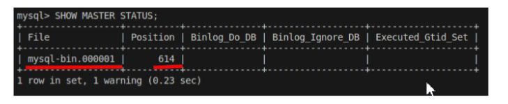
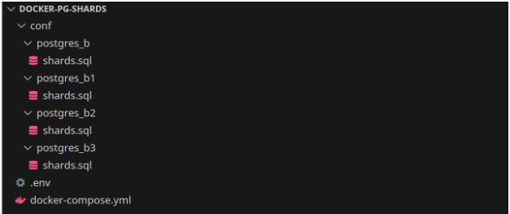

# Репликация

Создадим контейнер с именем replication-master и зададим пароль root пользователя 123456

```bash
docker run -d --name replication-master -e MYSQL_ROOT_PASSWORD=123456 -p 3307:3306 mysql:8.3
```

Создадим контейнер с именем replication-slave и зададим пароль root пользователя 123456

```bash
docker run -d --name replication-slave -e MYSQL_ROOT_PASSWORD=123456 -p 3308:3306 mysql:8.3
```

Для реализации взаимодействия создадим мост и сеть:

```bash
docker network create replication
docker network connect replication replication-master
docker network connect replication replication-slave
```

Настройка компонентов

С помощью редактора файлов вносим изменения папка etc в файл my.cnf-> секция [mysqld] добавляем следующие параметры:

```text
server_id = 1
log_bin = mysql-bin
```

При изменении конфигурации сервера требуется перезагрузка:

```bash
docker restart replication-master
```

После требуется зайти в контейнер и проверить состояние:

```bash
docker exec -it replication-master mysql -u root -p
mysql> SHOW MASTER STATUS;
```

Значениия File и Position меняются каждый раз.



## !!!Важно запомнить Значения ячеек File и Position

Создадим учетную запись master для сервера репликации:

```bash
docker exec -it replication-master mysql -u root -p
```

В контейнере выполним:

```bash
mysql> CREATE USER 'replication'@'%';
mysql> GRANT REPLICATION SLAVE ON *.* TO 'replication'@'%';
```

Проверим права пользователя:

```bash
SHOW GRANTS FOR replication@'%';
```

Master готов,переходим к slave:

```bash
docker run --name replication-slave -e MYSQL_ROOT_PASSWORD=123456 -d mysql:8.3
```

Открываем конфигурационный файл на Slave my.cnf.
my.cnf-> секция [mysqld] добавляем следующие параметры:

```text
log_bin = mysql-bin
server_id = 2
relay-log = /var/lib/mysql/mysql-relay-bin
relay-log-index = /var/lib/mysql/mysql-relay-bin.index
read_only = 1
```

Перезагружаем slave:

```bash
docker restart replication-slave
```

Следующим шагом требуется прописать в базе данных на сервер **slave**,кто является master и данные **File** и **Position**,
полученные а результате выполнения команды **SHOW MASTER STATUS;** на мастере:

```shell
docker exec -it replication-slave mysql -u root -p
mysql> CHANGE MASTER TO
MASTER_HOST='replication-master',
MASTER_USER='replication',
MASTER_LOG_FILE='mysql-bin.000001',
MASTER_LOG_POS=614;
```

Далее запускаем журнал ретрансляции и проверим статус операций:

```sql
mysql> START REPLICA IO_THREAD;
mysql> SHOW SLAVE STATUS\G
```

## Ключевыенастройки

- Slave_IO_State,Slave_SQL_State—состояние IO потока, принимающего двоичный журнал с мастера,и состояние потока,применяющего журнал ретрансляции
- Read_Master_Log_Pos—последняя позиция, прочитанная из журнала мастера
- Relay_Master_Log_File—текущий файл журнала мастера
- Seconds_Behind_Master—отставание данных в секундах
- Last_IO_Error,Last_SQL_Error—ошибки репликации, если они есть

## Режим master-master

```bash
docker run -d --name replication-master-one -e MYSQL_ALLOW_EMPTY_PASSWORD=true -v ~/path/to/world/dump:/docker-entrypoint-initdb.d mysql:8.3

docker run -d --name replication-master-two -e MYSQL_ALLOW_EMPTY_PASSWORD=true -v ~/path/to/world/dump:/docker-entrypoint-initdb.d mysql:8.3

docker network create replication
docker network connect replication replication-master-one
docker network connect replication replication-master-two
```

Конфигурационный файл my.conf должен содержать:

```text
server_id = 1
log_bin = mysql-bin #на первом
server_id = 2
log_bin = mysql-bin #на втором
```

## На втором сервере выполнить

```sql
stop slave;

change MASTER to MASTER_HOST = 'replication-master-one',
MASTER_USER = 'replicator',
MASTER_PASSWORD = 'password',
MASTER_LOG_FILE = 'mysql-bin.000001',
MASTER_LOG_POS = 107;

start slave;
```

## На первом

```sql
stop slave;

change MASTER to MASTER_HOST = 'replication-master-two',
MASTER_USER ='replicator',
MASTER_PASSWORD = 'password',
MASTER_LOG_FILE ='mysql-bin.000001',
MASTER_LOG_POS = 107;

start slave;
```

### Важно добавить пользователей на обоих серверах

```sql
create user 'replicator' @'%' identified by 'password';

create database example;

grant replication slave on
*.* to 'replicator' @'%';
```

Перезагружаемся и проверяем

### Меняем данные на server-master

```bash
docker exec -it replication-master-one mysql
```

```sql
create database world;

show databases;

use world;

insert
 into
    city (Name, CountryCode, District, Population)
    values ('Test-Replication', 'ALB', 'Test', 42);
```

```bash
docker exec -it replication-master-two mysql
```

```sql
SHOW databases;
USE world;
SHOW tables;
SELECT * FROM city ORDER BY ID DESC LIMIT 1;
```

## Шаг 1: Запуск двух контейнеров MySQL

Создадим две MySQL-ноды (mysql-master1 и mysql-master2) с открытыми портами и переменными для репликации.

```bash
docker run -d --name mysql-master1 \
  -e MYSQL_ROOT_PASSWORD=root \
  -e MYSQL_REPLICATION_USER=repl \
  -e MYSQL_REPLICATION_PASSWORD=repl \
  -p 3307:3306 \
  mysql:8.0 \
  --server-id=1 \
  --log-bin=mysql-bin \
  --binlog-format=ROW \
  --gtid-mode=ON \
  --enforce-gtid-consistency=ON \
  --skip-replica-start

docker run -d --name mysql-master2 \
  -e MYSQL_ROOT_PASSWORD=root \
  -e MYSQL_REPLICATION_USER=repl \
  -e MYSQL_REPLICATION_PASSWORD=repl \
  -p 3308:3306 \
  mysql:8.3 \
  --server-id=2 \
  --log-bin=mysql-bin \
  --binlog-format=ROW \
  --gtid-mode=ON \
  --enforce-gtid-consistency=ON \
  --skip-replica-start
  ```

## Пояснение параметров

- server-id – уникальный ID сервера (должен отличаться).
- log-bin – включает бинарный лог (необходим для репликации).
- gtid-mode=ON – использует GTID (Global Transaction ID) для удобной синхронизации.
- skip-slave-start – не запускать репликацию автоматически (настроим вручную).

## Шаг 2: Настройка Master-Master репликации

1. Настройка первого мастера (mysql-master1)

Зайдём в контейнер:

```bash
docker exec -it mysql-master1 mysql -uroot -proot
```

```sql
-- Создаём пользователя для репликации (уже создан через переменные, но можно проверить)
CREATE USER IF NOT EXISTS 'repl'@'%' IDENTIFIED BY 'repl';
GRANT REPLICATION SLAVE ON *.* TO 'repl'@'%';
FLUSH PRIVILEGES;

-- Получаем текущую позицию бинарного лога
SHOW MASTER STATUS;
```

Запомните File (например, mysql-bin.000003) и Position (например, 157).

2. Настройка второго мастера (mysql-master2)
Зайдём в контейнер:

```bash
docker exec -it mysql-master2 mysql -uroot -proot
```

```sql
-- Создаём пользователя для репликации
CREATE USER IF NOT EXISTS 'repl'@'%' IDENTIFIED BY 'repl';
GRANT REPLICATION SLAVE ON *.* TO 'repl'@'%';
FLUSH PRIVILEGES;

-- Получаем текущую позицию бинарного лога
SHOW MASTER STATUS;
```

Запомните File и Position (например, mysql-bin.000003 и 834).

## Шаг 3: Настройка репликации между мастерами

1. На mysql-master2 настраиваем репликацию с mysql-master1

```sql

CHANGE MASTER TO
  MASTER_HOST='mysql-master1',
  MASTER_USER='repl',
  MASTER_PASSWORD='repl',
  MASTER_LOG_FILE='mysql-bin.000003',  -- из SHOW MASTER STATUS на master1
  MASTER_LOG_POS=912,                  -- из SHOW MASTER STATUS на master1
  MASTER_AUTO_POSITION=0;

START SLAVE;
```

2. На mysql-master1 настраиваем репликацию с mysql-master2

```sql
CHANGE MASTER TO
  MASTER_HOST='mysql-master2',
  MASTER_USER='repl',
  MASTER_PASSWORD='repl',
  MASTER_LOG_FILE='mysql-bin.000003',  -- из SHOW MASTER STATUS на master2
  MASTER_LOG_POS=834,                  -- из SHOW MASTER STATUS на master2
  MASTER_AUTO_POSITION=0;

START SLAVE;
```

## Шаг 4: Проверка репликации

На обоих серверах выполните:

```sql
SHOW SLAVE STATUS\G
```

## Что должно быть

- Slave_IO_Running: Yes
- Slave_SQL_Running: Yes
- Seconds_Behind_Master: 0 (или небольшое число)

## Если есть ошибки, проверьте

- Доступность контейнеров (ping mysql-master1 из mysql-master2).
- Правильность паролей и параметров MASTER_LOG_FILE / MASTER_LOG_POS.

## Шаг 5: Тестирование

1. Создайте базу на mysql-master1:

```sql
CREATE DATABASE test_db;
USE test_db;
CREATE TABLE test_table (id INT);
INSERT INTO test_table VALUES (1);
```

2. Проверьте на mysql-master2:

```sql
SHOW DATABASES;  -- должна появиться test_db
SELECT * FROM test_db.test_table;  -- должна быть запись
```

№ Партиционирование

Для запуска postgreSQL используем docker:

```bash
docker run --name neto-pg -e POSTGRES_PASSWORD=netology -d postgres
```

Для входа в терминал psql можно воспользоваться командой:

```bash
docker exec -it neto-pg psql -U postgres
```

Создадим отношение:

```sql
CREATE TABLE workers (
id uuid not null,
category int
) PARTITION BY RANGE (category);
```

В отношение 2 атрибутов: **id** и **category** партиционирование будем производить по признаку **category**

Добавим 3 партиции :

```sql
CREATE TABLE workers_1
PARTITION OF workers
FOR VALUES FROM (1) TO (4);

CREATE TABLE workers_2
PARTITION OF workers
FOR VALUES FROM (4) TO (7);

CREATE TABLE workers_3
PARTITION OF workers
FOR VALUES FROM (7) TO (10);

Наполним отношение workers данными: включим расширение для использования UUID:

```sql
CREATE EXTENSION IF NOT EXISTS "uuid-ossp";
```

Заполним отношение значениями с категориями от 1 до 9:

```sql
insert into workers (id, category)
values (
uuid_generate_v4(),
generate_series(1::int, 9::int, 1)
);
```

Выполним проверки:

```sql
select * from workers_1;

select * from workers_2;

select * from workers_3;
```

Каждая партиция содержит данные из определенной для неё категории

## Шардинг

Для запуска postgreSQL используем docker compose. Создадим файл **docker-compose.yml** и добавим в него узел master:

```yml
version: '3.8'
services:
 postgres_b:
  image: postgres:latest
  container_name: "postgres_b"
  env_file: .env
  environment:
   PGDATA: "/var/lib/postgresql/data/pgdata"
  ports:
   - "5632:5432"
  volumes:
   - ./conf/postgres_b/shards.sql:/docker-entrypoint-initdb.d/start.sql
   ```

Основные настройки:

- postgres_b – имя контейнера
- image: postgres:latest – образ postgreSQL
- env_file – путь к файлу переменных окружения
- ports – маппинг портов docker network на локальный хост
- volume – подключение внешнего хранилища
- ./conf/postgres_b/shards.sql:/docker-entrypoint-initdb.d/start.sql – путь к скрипту инициализации

Добавим в docker-compose.yml шарды:

```yml
postgres_b1:
 image: postgres:latest
 container_name: "postgres_b1"
 env_file: .env
 environment:
  PGDATA: "/var/lib/postgresql/data/pgdata"
 ports:
  - "5633:5432"
 volumes:
  - ./conf/postgres_b1/shards.sql:/docker-entrypoint-initdb.d/start.sql

postgres_b2:
 image: postgres:latest
 container_name: "postgres_b2"
 env_file: .env
 environment:
  PGDATA: "/var/lib/postgresql/data/pgdata"
 ports:
  - "5634:5432"
 volumes:
  - ./conf/postgres_b2/shards.sql:/docker-entrypoint-initdb.d/start.sql

postgres_b3:
 image: postgres:latest
 container_name: "postgres_b3"
 env_file: .env
 environment:
  PGDATA: "/var/lib/postgresql/data/pgdata"
 ports:
  - "5635:5432"
 volumes:
  - ./conf/postgres_b3/shards.sql:/docker-entrypoint-initdb.d/start.sql
```

Структура проекта для docker-compose.yml:



Файл shards.sql:

```sql

CREATE EXTENSION postgres_fdw;
/* SHARD 1 */
/* регистрируем сервер с шардом*/
CREATE SERVER books_1_server
FOREIGN DATA WRAPPER postgres_fdw
OPTIONS (host 'postgres_b1', port '5432', dbname 'books');

/* настраиваем маппинг*/
CREATE USER MAPPING FOR "postgres"
SERVER books_1_server
OPTIONS (user 'postgres', password 'postgres');

/* создаём таблицу*/
CREATE FOREIGN TABLE books_1
(
id bigint not null,
category_id int not null,
author character varying not null,
title character varying not null,
year int not null
) SERVER books_1_server
OPTIONS (schema_name 'public', table_name 'books');
```

SHARD 2 и SHARD 3 аналогично изменяются строки:

```sql
CREATE SERVER books_1_server на CREATE SERVER books_2_server и CREATE SERVER books_3_server
OPTIONS (host 'postgres_b1', port '5432', dbname 'books'); на OPTIONS (host 'postgres_b2', port '5432', dbname 'books'); и OPTIONS (host 'postgres_b3', port
'5432', dbname 'books');
CREATE FOREIGN TABLE books_1 на CREATE FOREIGN TABLE books_2 и CREATE FOREIGN TABLE books_3

/* добавляем представления */
CREATE VIEW books AS
SELECT *
FROM books_1
UNION ALL
SELECT *
FROM books_2
UNION ALL
SELECT *
FROM books_3;

* добавляем критерии заполнения */
CREATE RULE books_insert AS ON INSERT TO books
DO INSTEAD NOTHING;
CREATE RULE books_update AS ON UPDATE TO books
DO INSTEAD NOTHING;
CREATE RULE books_delete AS ON DELETE TO books
DO INSTEAD NOTHING;
CREATE RULE books_insert_to_1 AS ON INSERT TO books
WHERE (category_id <= 3)
DO INSTEAD INSERT INTO books_1
VALUES (NEW.*);
CREATE RULE books_insert_to_2 AS ON INSERT TO books
WHERE (category_id > 3 and category_id <= 6)
DO INSTEAD INSERT INTO books_2
VALUES (NEW.*);
CREATE RULE books_insert_to_3 AS ON INSERT TO books
WHERE (category_id > 6)
DO INSTEAD INSERT INTO books_3
VALUES (NEW.*);

* создаём отношение */
CREATE TABLE books
(
id bigint not null,
category_id int not null,
CONSTRAINT category_id_check CHECK (category_id > 3 and category_id <= 6),
author character varying not null,
title character varying not null,
year int not null
);
/* добавляем индексацию по полю category_id*/
CREATE INDEX books_category_id_idx ON books USING btree(category_id)
```

Файл postgres_b2/shards.sql :

```sql
CREATE TABLE books
(
id bigint not null,
category_id int not null,
CONSTRAINT category_id_check CHECK (category_id > 3 and category_id <= 6),
author character varying not null,
title character varying not null,
year int not null
);
CREATE INDEX books_category_id_idx ON books USING btree(category_id)
```

Файл postgres_b3/shards.sql :

```sql
CREATE TABLE books
(
id bigint not null,
category_id int not null,
CONSTRAINT category_id_check CHECK (category_id > 6),
author character varying not null,
title character varying not null,
year int not null
);
CREATE INDEX books_category_id_idx ON books USING btree(category_id)
```

Для заполнения таблицы выполним SQL запрос:

```sql
INSERT INTO books (id, category_id, author, title, year)
VALUES (1, 1, 'Author1', 'book1', 1980),
(2, 2, 'Author2', 'book2', 1997),
(3, 5, 'Author3', 'book3', 2005),
(4, 2, 'Author4', 'book4', 2005),
(5, 7, 'Author5', 'book5', 2005),
(6, 5, 'Author6', 'book6', 2001),
(7, 9, 'Author7', 'book7', 1917),
(8, 2, 'Author8', 'book8', 1956),
(9, 1, 'Author9', 'book9', 1972),
(10, 8, 'Author10', 'book10', 1993);
```

Выполним проверки:

```sql
select * from books_1;
select * from books_2;
select * from books_3;
```

Каждый шард содержит данные из определенной для неё категории
